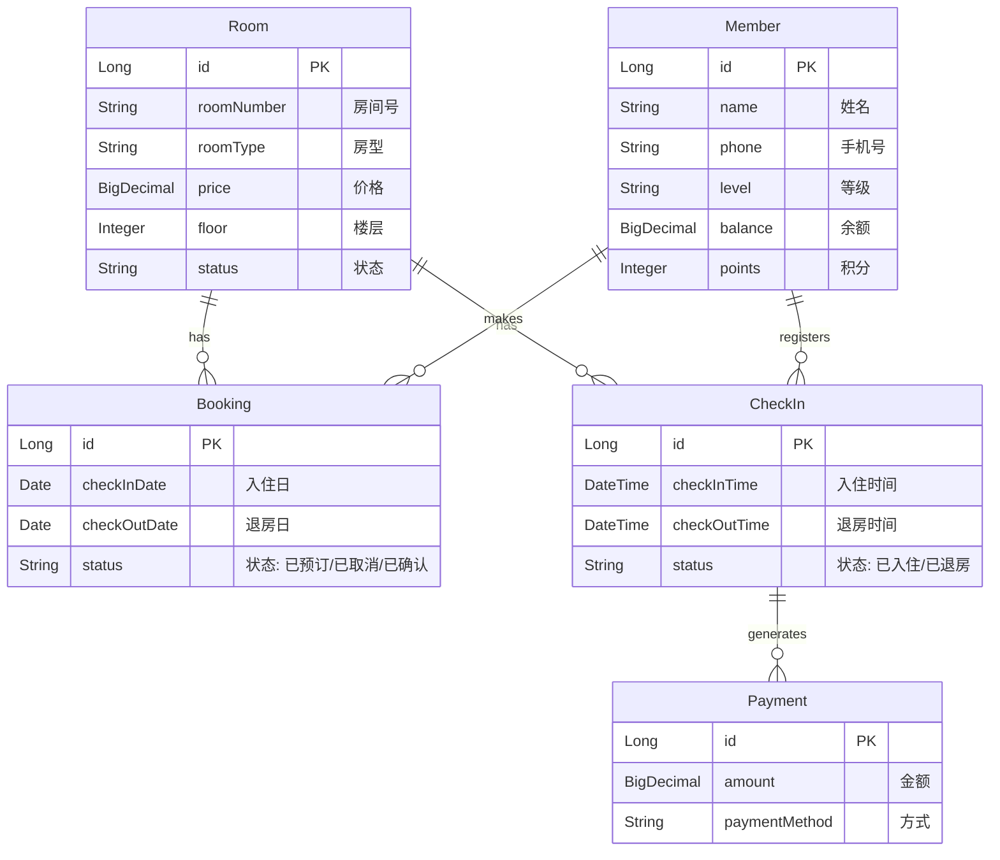

# 系统设计文档 (System Design)

## 1. 数据库设计 (Database Design)

系统核心实体关系如下：



## 2. API 设计规范

遵循 RESTful 风格设计接口。

### 通用响应格式
```json
{
  "code": 200,      // 状态码：200成功，其他失败
  "message": "成功", // 响应消息
  "data": { ... }   // 业务数据
}
```

### 核心接口概览

| 模块 | 路径 | 方法 | 描述 |
|------|------|------|------|
| **认证** | `/api/auth/login` | POST | 管理员登录 |
| **客房** | `/api/rooms` | GET | 获取客房列表 |
| | `/api/rooms/{id}` | PUT | 更新客房信息 |
| **预订** | `/api/bookings` | POST | 创建预订 |
| | `/api/bookings/{id}/confirm` | POST | 确认入住 |
| **会员** | `/api/members` | GET | 获取会员列表 |
| | `/api/members/{id}/recharge` | POST | 会员充值 |
| **报表** | `/api/reports/revenue` | GET | 获取收入报表 |

## 3. 目录结构设计

### 后端 (Spring Boot)
```
backend/src/main/java/com/hotel/
├── config/       # 配置类 (Security, WebMvc, ExceptionHandler)
├── controller/   # 控制器层 (API endpoints)
├── service/      # 业务逻辑层 (Transactional services)
├── repository/   # 数据访问层 (JPA Repositories)
├── entity/       # 数据库实体 (JPA Entities)
├── dto/          # 数据传输对象 (Request/Response bodies)
└── util/         # 工具类 (JWT, Date utils)
```

### 前端 (Vue 3)
```
frontend/src/
├── api/          # API 接口封装
├── components/   # 公共组件 (Forms, Charts)
├── pages/        # 页面视图 (Layouts, Dashboard)
├── router/       # 路由配置
├── styles/       # 全局样式
└── utils/        # 工具函数 (Request, Formatting)
```
